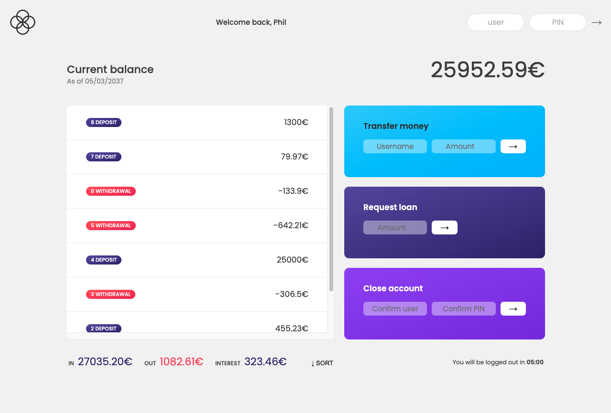
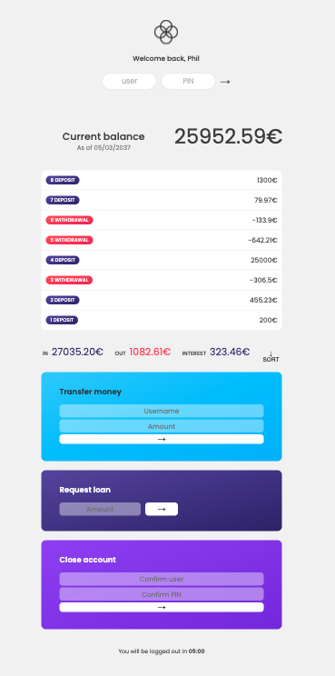

# TrustBank App

*image created by dall-e*

Built with HTML, CSS, and JavaScript, this application enables users to deposit and request funds across a range of predetermined accounts. It leverages JavaScript principles such as manipulating the Document Object Model (DOM), utilizing functions, and primarily employing arrays and array methods.

Developed under the guidance of Jonas Schmedtmann and his JavaScript course, this application will continually undergo independent enhancements in the future.

The following are the preconfigured accounts available for logging into the application.

## Features

- Login in
- Transfere between accounts
- Request loans
- Check Balance, total deposits and total withdrowal
- Sort by ammount
- Display the actual currecuy of the account: "EUR" or "USD"
- Close the account

### Preconfigured Accounts

Account 1

- Name: Phil Connors
- Username (to Login): pc
- Password: 1111

Account 2

- Name: Steve Zissou
- Username (to Login): sz
- Password: 2222

Account 3

- Name: Carl Spackerl
- Username (to Login): cs
- Password: 3333

Account 4

- Name: Bob Harris
- Username (to Login): bh
- Password: 4444

You can only transfer and request between these 4 accounts at the moment. Remember to type in the username (initials) when doing so.

## Technologies Used

HTML
CSS
Vanilla JavaScript

## Demo: https://trustbank.netlify.app/

